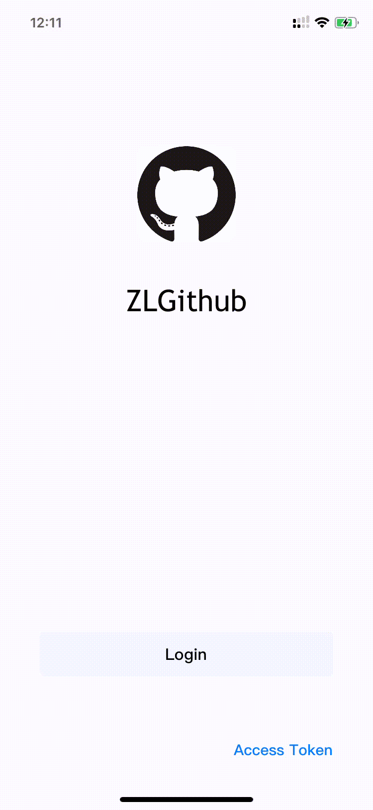
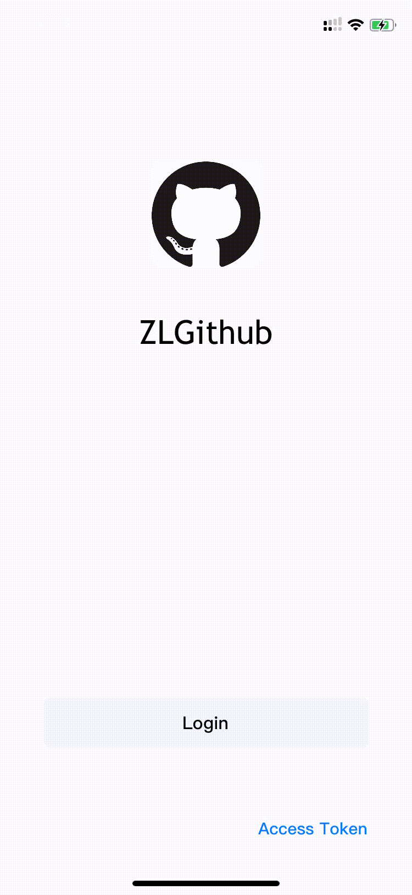
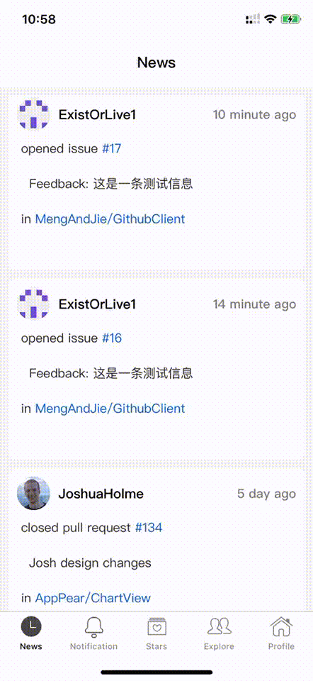

# ZLGithubClient

## Github iOS 客户端  by Existorlive

- Objective-c 2.0
- Swift 5 
- Cocoapods 1.9.1
- iOS >= 11.0

基于[Github REST API V3](https://docs.github.com/en/rest)开发的iOS客户端。目前支持以下的功能：

- 支持Github OAuth登录 和 Access Token 登录
- 查询和修改登录用户的profile
- 查看登录用户的repositories，gists，followers，following
- 查看repositories和users的趋势榜
- 根据关键字搜索repositories和users，支持advanced search
- 支持watch，star以及fork 指定的repository；支持follow指定的用户
- 查看指定repository的commit，branch，language，pull request以及issues等
- 支持简单查阅repository的代码
- 支持查阅Notification

#### Github OAuth login and Access Token login

#### Main page

#### Search repositories and users

#### Repository

#### Trending 

#### Events for the followings and repos watched

#### View markdown and code 

## 如何使用GithubClient源码

1. 在使用源码前，需要Github的账户下创建一个OAuth Application，具体请参考官方文档[Creating an OAuth App](https://docs.github.com/en/developers/apps/creating-an-oauth-app)

2. 创建OAuth Application后，获得`Client ID` 和 `Client Secret`。打开工程下`ZLGithubAPI.h`文件，替换宏`MyClientID` 和 `MyClientSecret`

3. 在工程ZLGithubClient目录下，执行`pod install` 安装工程依赖的库

4. 在 Xcode中运行工程

